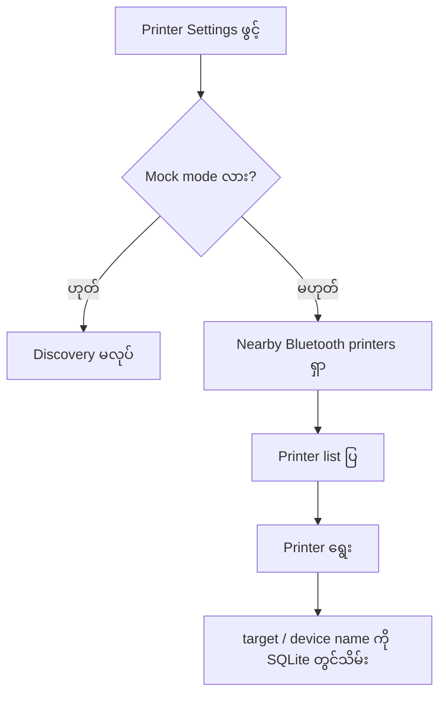
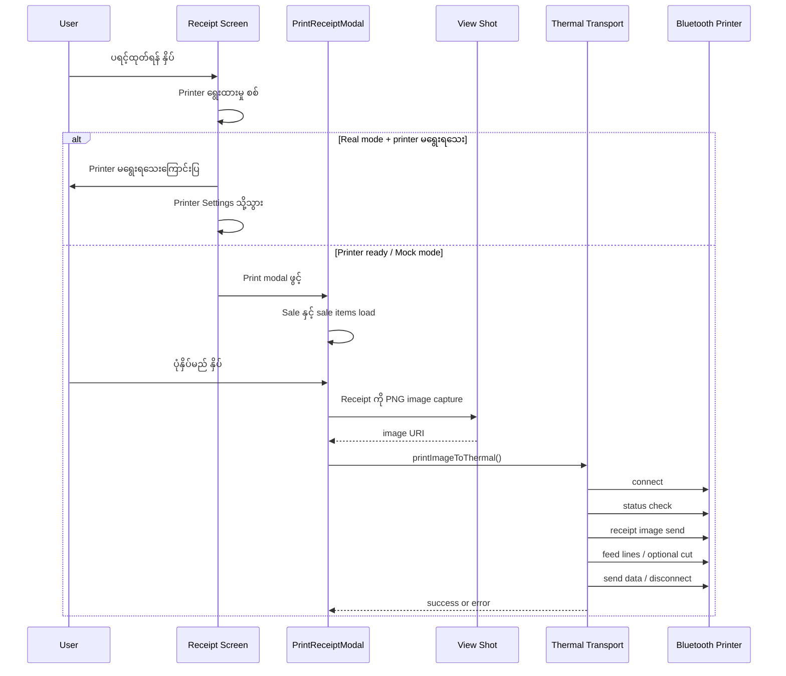

# Printer Logic Documentation

## ရည်ရွယ်ချက်

ဤ POS app တွင် Bluetooth thermal printer သို့ receipt ကို ပုံနှိပ်ရန် printer logic ပါရှိပါသည်။ Printer flow သည် mock mode နှင့် real Epson/ESC-POS printer mode နှစ်မျိုးကို support လုပ်ပါသည်။

> **မှတ်ချက်**: Real printer mode သည် Android Bluetooth Classic နှင့် Epson-compatible thermal printer များကို အဓိက ရည်ရွယ်ထားပါသည်။

## အဓိက Files

| File | တာဝန် |
| --- | --- |
| `App.tsx` | Printer state/settings ကို load, save, screen များသို့ props ပို့ပေးခြင်း |
| `src/screens/PrinterScreen.tsx` | Printer mode, Bluetooth discovery, printer selection, paper width, auto-cut, test print UI |
| `src/components/PrintReceiptModal.tsx` | Receipt data ကို load လုပ်ပြီး image capture ပြုလုပ်ကာ print ပို့ခြင်း |
| `src/thermalPrint.ts` | ESC/POS printer connection, status check, image send, cut, disconnect logic |
| `src/db.ts` | Printer settings key/type များ |
| `app.json` | Android Bluetooth permissions |
| `jest.setup.js` | Native printer module mocks |
| `__tests__/thermalPrint.test.ts` | Thermal print transport tests |

## Printer Settings

အောက်ပါ setting များကို SQLite `app_settings` table တွင် သိမ်းထားပါသည်။

| Setting key | အဓိပ္ပာယ် |
| --- | --- |
| `printer_target` | Bluetooth printer target/address |
| `printer_device_name` | ရွေးထားသော printer အမည် |
| `printer_mode` | `epson` သို့မဟုတ် `mock` |
| `printer_paper_width` | `58` သို့မဟုတ် `80` mm |
| `printer_auto_cut` | `1` = auto cut ဖွင့်, `0` = ပိတ် |

`App.tsx` စတင်ချိန်တွင် setting များကို SQLite မှ load လုပ်ပြီး in-memory state တွင်ထားပါသည်။ Printer ရွေးချယ်ခြင်း သို့မဟုတ် setting ပြောင်းခြင်းတိုင်း SQLite တွင် ပြန်သိမ်းပါသည်။

## Printer Mode

### Real mode — `epson`

- Nearby Bluetooth printer များကို discovery လုပ်သည်။ Epson ePOS discovery အကန့်အသတ်ကြောင့် Generic ESC/POS device များကို အပြည့်အဝမအာမခံပါ။
- Printer မရွေးရသေးလျှင် receipt print မလုပ်မီ printer settings screen သို့ပို့သည်။
- Receipt image ကို physical printer သို့ ESC/POS transport ဖြင့်ပို့သည်။

### Mock mode — `mock`

- Physical printer မလိုပါ။
- Connection, image send, cut, disconnect action များကို mock adapter ဖြင့် success အဖြစ် simulate လုပ်သည်။
- UI/test flow စမ်းသပ်ရန်အသုံးပြုသည်။

## Printer Discovery Flow

`PrinterScreen.tsx` သည် `react-native-esc-pos-printer` ၏ discovery hook ကိုသုံးပါသည်။

Discovery filter:
- `bondedDevices: FALSE` — nearby Bluetooth device များကိုရှာသည်
- `epsonFilter: FILTER_NONE` — Epson-name filter ကိုမသုံးပါ
- `portType: BLUETOOTH`
- `deviceModel: MODEL_ALL`

## Receipt Print Flow

## Burmese Receipt Support

Receipt ကို printer text command အဖြစ် တိုက်ရိုက်မပို့ပါ။ `react-native-view-shot` ဖြင့် receipt UI ကို PNG image အဖြစ် capture လုပ်ပြီး printer သို့ပို့ပါသည်။

ဤနည်းလမ်းကြောင့်:
- Pyidaungsu Burmese font ကို image ထဲတွင် render လုပ်နိုင်သည်။
- Printer character encoding မပံ့ပိုးသည့် မြန်မာစာများ ပျက်နိုင်ခြေ လျော့နည်းသည်။
- Image print ဖြစ်သောကြောင့် text-only print ထက် အနည်းငယ်နှေးနိုင်သည်။

## Thermal Transport

`src/thermalPrint.ts` ရှိ `printImageToThermal()` သည် အောက်ပါအတိုင်း လုပ်ဆောင်သည်။

1. Exclusive printer queue ထဲတွင် task ထည့်သည်။
2. Printer ကို connect လုပ်သည်။
3. Online status စစ်သည်။
4. Offline/connection error ဖြစ်လျှင် default 3 ကြိမ် retry လုပ်သည်။
5. Receipt image ပို့သည်။
   - 58 mm → `384 dots`
   - 80 mm → `576 dots`
6. Feed line 2 လိုင်းထည့်သည်။
7. Auto-cut ဖွင့်ထားလျှင် cut command ပို့သည်။
8. Data ကို send လုပ်သည်။
9. အဆုံးတွင် disconnect လုပ်သည်။

## Error Handling

| Error code | အဓိပ္ပာယ် |
| --- | --- |
| `connect_timeout` | Printer connect မရခြင်း |
| `offline` | Printer online status မရခြင်း |
| `send_unknown` | Send ပြီး/မပြီး မသေချာခြင်း |
| `unknown` | အခြားမသတ်မှတ်ထားသော error |

Print modal တွင် error message ပြပြီး retry button ဖြင့် ထပ်မံပုံနှိပ်နိုင်သည်။

> `send_unknown` ဖြစ်လျှင် receipt ပုံနှိပ်ပြီးသား ဖြစ်နိုင်ပါသည်။ Duplicate receipt မထွက်စေရန် printer paper ကို အရင်စစ်သင့်သည်။

## Android Requirements

Real printer mode အတွက် Android native build လိုအပ်ပါသည်။

### Permission အခြေအနေ

`app.json` တွင် Bluetooth Classic discovery အတွက် လိုအပ်သော Android permissions များကို ထည့်ထားပါသည်။

ထည့်ထားသော permissions:

- `android.permission.BLUETOOTH`
- `android.permission.BLUETOOTH_ADMIN`
- `android.permission.BLUETOOTH_SCAN`
- `android.permission.BLUETOOTH_CONNECT`
- `android.permission.ACCESS_COARSE_LOCATION`
- `android.permission.ACCESS_FINE_LOCATION`

`react-native-esc-pos-printer` သည် Android version အလိုက် လိုအပ်သော runtime permission ကို request ပြုလုပ်ပါသည်။ Permission configuration ပြောင်းပြီးတိုင်း native Android app ကို rebuild/install ပြန်လုပ်ရန်လိုပါသည်။

အသုံးပြုထားသော native libraries:
- `react-native-esc-pos-printer`
- `react-native-view-shot`

## Expo Go Limitation

Expo Go တွင် custom native module မပါဝင်သောကြောင့် real Bluetooth printer action မလုပ်နိုင်ပါ။ Physical printer စမ်းသပ်ရန် Android development build သို့မဟုတ် production APK build ပြန်တည်ဆောက်ရမည်။

## Physical Printer Testing Checklist

1. Android Bluetooth settings မှာ thermal printer ကို pair လုပ်ပါ။
2. App ကို Android development/production build ဖြင့်ဖွင့်ပါ။
3. Home → Printer screen သို့သွားပါ။
4. Real Epson mode ရွေးပါ။
5. Search ကိုနှိပ်ပြီး paired printer ကိုရွေးပါ။
6. Paper width ကို 58 mm သို့မဟုတ် 80 mm သတ်မှတ်ပါ။
7. Printer မှာ cutter မရှိလျှင် auto-cut ကိုပိတ်ပါ။
8. Test Print နှိပ်ပါ။
9. Sale တစ်ခုလုပ်ပြီး receipt print ကိုစမ်းပါ။
10. Burmese text၊ item list၊ total amount၊ paper width နှင့် cut behavior ကိုစစ်ပါ။

## Compatibility Notes

- Epson Bluetooth Classic / compatible thermal printer များကို ဦးစားပေးထားသည်။
- Generic ESC/POS printer များသည် pairing/discovery ဖြစ်နိုင်သော်လည်း actual print compatibility ကို physical printer ပေါ်တွင် စမ်းသပ်အတည်ပြုရန်လိုသည်။
- Bluetooth BLE printer နှင့် အခြား printer brand များကို အပြည့်အဝ အာမခံမပေးပါ။
